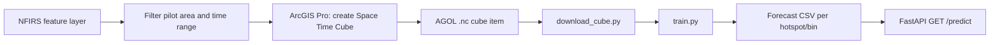

# GeoPulse Forecasting Engine

This repository pulls an ArcGIS Online Space Time Cube, trains an ArcGIS Learn
time-series model, and writes per-bin forecast records for the backend to use.

## Setup

Use the same Python environment that provides ArcGIS Pro / `arcgis.learn`.
Install the small helpers that are not always included with ArcGIS:

```powershell
conda install -c conda-forge python-dotenv xarray
```

`arcgis.learn` also needs its deep-learning backend. In an ArcGIS Pro environment
it is normally installed already; run `import torch` to confirm. Training falls
back to CPU when no compatible GPU is available, but it can be slow on a large cube.

Copy [.env.example](.env.example) to `.env`, then enter the organization URL,
AGOL account, password, and cube item ID. Never commit `.env`.

## Run

```powershell
$python = 'C:\Program Files\ArcGIS\Pro\bin\Python\envs\arcgispro-py3\python.exe'
& $python download_cube.py
& $python train.py --cube data/cube/your_cube.nc --variable INCIDENT_COUNT --bin-id-field LOCATION_ID
```

On this machine, the default `python` command is the Windows Store alias, so
use the ArcGIS Pro interpreter above (or activate its conda environment first).

The first command downloads the shared cube to `data/cube`. The second first
lists the exact NetCDF data-variable names if `INCIDENT_COUNT` is wrong, then
saves the trained model under `models/incident_forecast_v1` and writes
`data/outputs/incident_forecast.csv`.

The CSV contains the requested bin ID field plus a `predicted_incident_count`
column where the installed `TimeSeriesModel.predict` output provides a numeric
forecast. It is the hand-off format for a later FastAPI `/predict` endpoint or
a hosted feature-layer join.

## Forecast Pipeline



## ArcGIS API Compatibility Note

The proposed `prepare_tabulardata(cube_path, variable_names=[...])` and
`TimeSeriesModel(...).predict(...)` flow is version-dependent. The script calls
only supported keyword arguments and prints the installed ArcGIS version and
signatures whenever the installed API rejects the cube or prediction call. If
that happens, paste that output into the team chat: it identifies the precise
API adjustment needed for your ArcGIS Pro version.